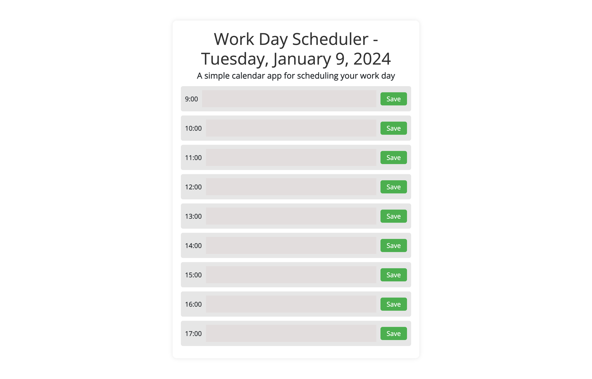
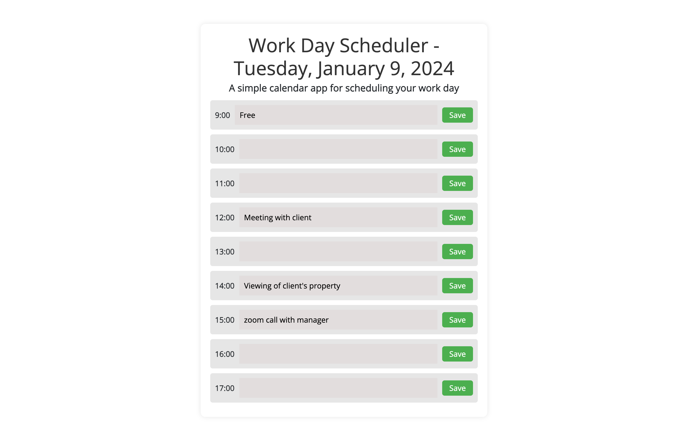

# Graces-Planner-App

Table of Contents
Intro on Challenge
Link to URL
Link to repo
Screenshot of Graces planner app

This week's challenge was to create to a planner app.
I was able to achieve this by first getting the starter code that had been provided, which was html and the style sheet, i later added a js file for the functionality of the app.  

The app was created, appointments are able to be booked and saved to local storage, challenge was well achieved. 

[link to github URL Graces-planner-App](https://github.com/GraceEmah17/Graces-Planner-App.git)

